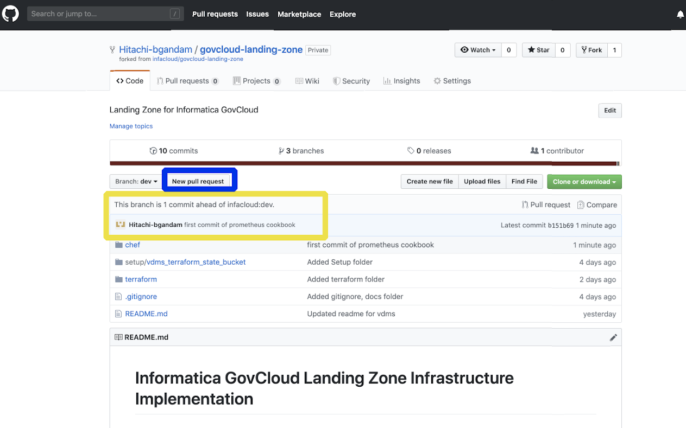
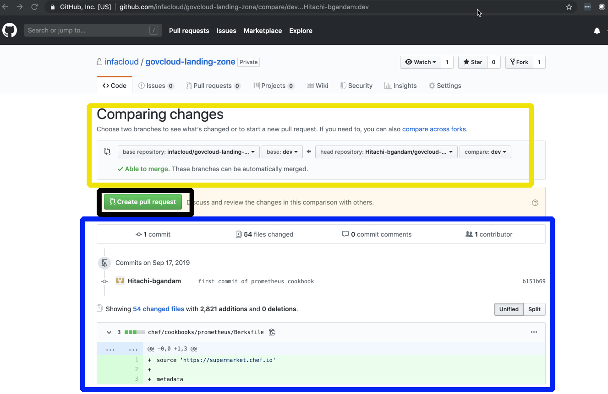
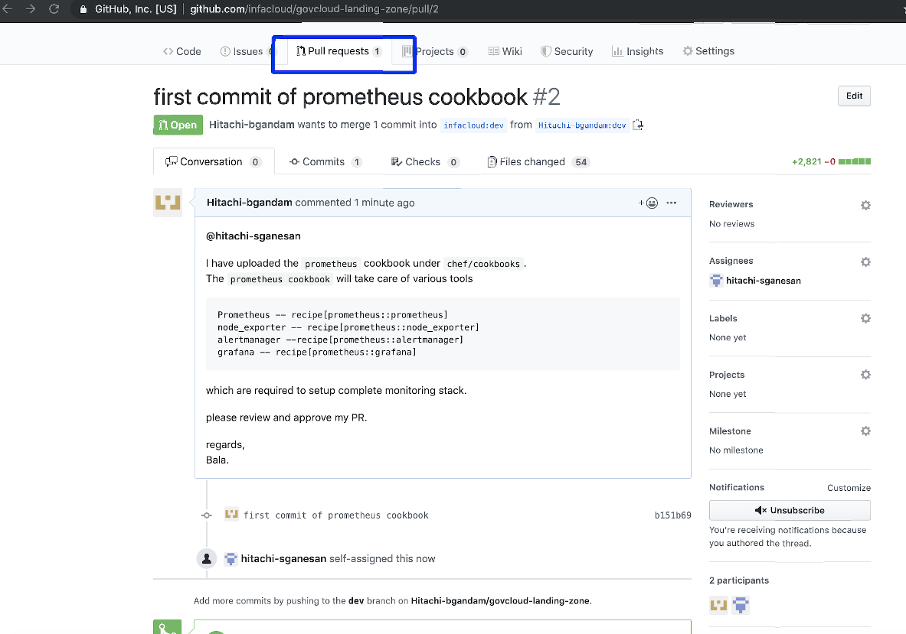

# Chef cookbook development standards

## Index:
1. [Developemnt metology](#TestDrivenDevelopement)
2. [Local Development environment](#LocalDevEnv)
    * Git
        * git hooks
    * ChefDK
        * additional plugins
        * how to use ruby
    * [IDE](#LocalDevEnvIDE) : visual studio code, sublime, atom
        * plugins: FoodCritic, InSpec, terraform and RuboCop ruby/chef language support
3. [Git](#GIT)
    * [branches](#GITBranches)
    * [issues](#GITIssues)
    * [commit/merge requests](#GITCommits)
    * [releases]

4. [Development](#DEV)
    * [Git Issue (from Jira, etc...)](#DEVGitIssue)
    * [Git Branch](#DEVGitBranch)
    * [Git Commit](#DEVGitCommit)
    * Code development, quality and formatting
    * Validation checks
    * [Testing](#DEVTesting)
        * [Local](#DEVTestingLocal)
        * [Remote](#DEVTestingRemote)


5. Release
    * release branch
    * sdo copy

## Test driven cookbook development <a name="TestDrivenDevelopement"></a>
"Delivering correct code that meets team standards and preservs existing functionality across all required platforms but.. at a much slower pace, with a lot more code to define, comannds to execute and ultimately not feeling very confident; maybe even feeling more insecure about the code you develop"

1) Define a test that express the desired state
2) Implement the solution
3) Verify that the implementation meets the desired state
4) Refactore

[ make change ] --> [ run testing tools ] --> [ automated verification ]

make change (static analysis):
- foodcritic
- rubocop

run testing tools (test driven development):
- kitchen list
- kitchen create
- kitchen converge
- kitchen verify
- kitchen test
- kitchen destroy

automated verification (unit test):
- rspec --init
- rspec
- rspec spec/unit/rec...

Learning videos, sources: </br>
https://learn.chef.io/modules/best-practices-for-testing/test-driven-cookbook-development#/ </br>
The Joy of Automating - https://www.youtube.com/playlist?list=PLjXnjUrL_V2j8bqMGWgFCvNbMastNp2Cv</br>
Better Tools for a Better Life - https://www.youtube.com/watch?v=LHi30LzRUlA </br>

What is Integration test? (KitchenCI + Inspec)
What is Unit test? (ChefSpec + RSpec)

## Local development environment <a name="LocalDevEnv"></a>

## GIT <a name="GIT"></a>
### Branches <a name="GITBranches"></a>

[master]
[release]
[develop]
[feature]
### Issues <a name="GITIssues"></a>
Quick walktrhough of how to use feature,bug branches and pull request to develop and adding them to the project. Below are the steps working on a new
#### feature (feature/[#issuenumber])
when starting a new feature (#123) , make sure to start with the latest codebase by forking your own copy to your account and using master branch or specified branch as your team:
##### step1 :click on fork 

##### step2 :copy to own your account

```
git clone https://github.com/reancloud/cookbook_development.git
cd .\cookbook_development\
git checkout master
git checkout -b feature/123
```
-> Switched to a new branch 'feature/123'

This branch can contain commit which belongs only that feature, not else! If you are working on multiple issues use multiple branches.
When you are making a commit, always use references on the issue number like (#issuenum)
```
workstation:cookbook_development bgandam$ git status
On branch feature/123
Untracked files:
  (use "git add <file>..." to include in what will be committed)

        .kitchen.dokken.yml

nothing added to commit but untracked files present (use "git add" to track)

workstation:cookbook_development bgandam$ git add .kitchen.dokken.yml
workstation:cookbook_development bgandam$ git commit .kitchen.dokken.yml -m 'one file, one line #123'
[feature/123 91d3b68] one file, one line #475
 1 file changed, 1 insertion(+)
 create mode 100644 .kitchen.dokken.yml
```
About references: https://guides.github.com/features/issues/#notifications

If you have only one or the last commit with fixing the feature, you can include keywords (close, fix, fixes etcc) https://help.github.com/articles/closing-issues-using-keywords/

```
workstation:cookbook_development bgandam$ git commit .kitchen.dokken.yml -m 'last commit for that feature (fixes #123)'
[feature/123 a3fd06f] last commit for that feature (fixes #123)
 1 file changed, 2 insertions(+), 1 deletion(-)
```
and the issue will be closed automatic way during the merge!

Push your changes and make a pull request into the origin/develop branch
```
workstation:cookbook_development bgandam$ git push --set-upstream origin feature/123
Counting objects: 6, done.
Delta compression using up to 4 threads.
Compressing objects: 100% (5/5), done.
Writing objects: 100% (6/6), 623 bytes | 0 bytes/s, done.
Total 6 (delta 2), reused 0 (delta 0)
remote: Resolving deltas: 100% (2/2), completed with 1 local object.
To git@github.com/reancloud/cookbook_development.git
 * [new branch]      feature/123 -> feature/123
Branch feature/123 set up to track remote branch feature/475 from origin.
```
[Jump to merge](#GITCommits)

#### bug (bug/[#issuenumber])
when starting a new bug fix (#123) , make sure to start with the latest codebase by forking your own copy to your account and using master branch - same way as for the feature.

Following the naming convention, the branch name have to be bug/issuenumber like
```
git clone git@github.com/reancloud/cookbook_development.git
cd .\cookbook_development\
git checkout master
git checkout -b bug/1234
```
-> Switched to a new branch 'bug/1234'

This branch can contain commit which belongs only that feature, not else! If you are working on multiple issues use multiple branches.
When you are making a commit, always use references on the issue number like (#issuenum)

[Jump to merge](#GITCommits)


### Git merge requests <a name="GITCommits"></a>
1) Raise a pull request from your repo, selecting the branch

2) Check the target and the source, example in yellow box  

3) always references on the original issue (#4123)
4) always try to include the result of the kitchen-verify output

Check your pull requests under upstream repo, sample PR(pull requests) 


5) Just a side note, why you have to use references in your commit messages
(more easier to track the changes)


### IDE <a name="LocalDevEnvIDE"></a>
You can use any kind of text editor what you want, this is just an example what I am using.

Sublime Text</br>
Atom </br>
Visual Studio Code </br>
emacs </br>
Notepad ++ </br>
RubyMine </br>

Key features of a modern editor: </br>
1) syntax highlighting
2) project/folder view
3) code snippets / plugin support
4) keyboard shortcuts

Visual Studio code
- download link: https://code.visualstudio.com/download
- plugins:
    - Chef Extension for Visual Studio Code: https://marketplace.visualstudio.com/items?itemName=Pendrica.Chef
    - Git History: https://marketplace.visualstudio.com/items?itemName=donjayamanne.githistory
    - InSpec: https://marketplace.visualstudio.com/items?itemName=burtlo.inspec
    - Ruby: https://marketplace.visualstudio.com/items?itemName=rebornix.Ruby
    - Ruby-Rubocop: https://marketplace.visualstudio.com/items?itemName=misogi.ruby-rubocop

## Development <a name="DEV"></a>

### Tracking by issues (GIT ISSUEgit issue (from Jira, etc...)) <a name="DEVGitIssue"></a>

In every case your changes have to base on a github issue - make it, use labels (enhancement/bug, apache/tomee, java/.net, wontfix etc..). If the source is in JIRA, put the link inside the ticket.

TODO: Link JIRA tickets together


### GIT branches based on issues <a name="DEVGitBranch"></a>
Alway create a new branch from master if you are fixing an issue. 1 issue / 1 branch! Do not mix issues in one branch more details see: [Jump](#GITIssues)

TODO: screenshot example

### Commit messages <a name="DEVGitCommit"></a>
Every commit message have to contain reference on issue

About references: https://guides.github.com/features/issues/#notifications

If you have only one or the last commit with fixing the feature, you can include keywords (close, fix, fixes etcc) https://help.github.com/articles/closing-issues-using-keywords/

TODO: screenshot example

### Code development, quality and formatting

### Validation checks

### Testing (chefdk - test-kitchen) <a name="DEVTesting"></a>
ChefDK contains the KitchenCI package which provides a test environment for you cookbook on different platforms - https://kitchen.ci/  &  https://github.com/test-kitchen/test-kitchen

Basic minimal general kitchen guide:
- create or extend the .kitchen.yml file in the cookbook, that will contain all configuration for your kitchen environment
- the Berksfile is the library for the third party cookbooks ( https://docs.chef.io/berkshelf.html )
- cli "kitchen create" : only makes a node or nodes
- cli "kitchen converge" : if the nodes does not exsits run the "create" part and running the cookbook based on suites runlists
- cli "kitchen verfiy" : if the nodes does not exsits, run the "converge" part, after validate the nodes
- cli "kitchen destroy" :  destroy the instance
- cli "kitchen test" create, converge, veirfy and destroy with one command

#### Local <a name="DEVTestingLocal"></a>

Requirement: ChefDK has to be installed

Virutalization provider can be:
- Docker (https://github.com/test-kitchen/kitchen-docker)
- Vagrant (https://github.com/test-kitchen/kitchen-vagrant)
TODO: PK!

#### Remote <a name="DEVTestingRemote"></a>

KitchenCI has the capability to integrate with remote hypervisors like: AWS (https://github.com/test-kitchen/kitchen-ec2), Azure (https://github.com/test-kitchen/kitchen-azurerm) , Google Coloud (https://github.com/test-kitchen/kitchen-google) or OpenStack (https://github.com/test-kitchen/kitchen-openstack)


